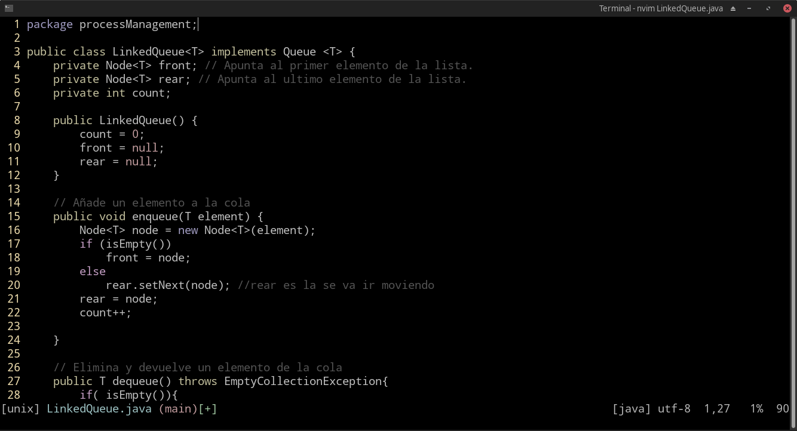

# Configuracion nvim o vim
Nvim es un fork de Vim haciendo mejoras a vim, anteriormente utilizaba vim pero conforme surgian nuevas necesidades 
que yo requeria, como por ejemplo el portapapeles, el poder copiar codigo de vim y utilizarlo en otra aplicaciones,
en la version de vim que tenia no funcionaba, todo era interno en vim con nvim pude resolver eso.

El archivo init de vim, el cual es el que es ejecutado cuando se inicia vim por primera vez, se encuentra en:
~~~
~/.config/nvim/init.vim
~~~

Para instalar los plugins primero necesitas descargar vim-plug:

Para el plugin de coc.vim necesitas instalar nodejs:

# Guide vim
~~~

[registro]<operador>[contador|movimiento]<objeto>

q: quit
w : save
qw: save and quit
q!: quit fource brute.
v : visualizasion
C-f : Next page
C-b : Back page
y : copy
d : cut
p : paste
C-u : undo

Term
vnew | term     :- terminal vertical
new | term      :- horizontal vertical

Edicion 
e: editar file 
sp: split edition 
vsp: vertical edition
ls : list buffers
bd: Delete buffer 
b [1..9]: Switch buffer 

Insert mode 
C-t : Insert one shiftwidth of indent at the start of the current line.
C-d : Delete one shiftwidth of indent at the start of the current line.

See :h i_Ctrl-t 

Insertar los mismo en varias columnas
C-V : Column mode 
S-v : Line mode 

C-v [count]<down> S-i "Escribes algo" <ESC>

Text 
viw: Select all word
vit: Select content tag
c{motion}: delete and start insert-mode
~: upper or lower case
* : Select string a buscar
C-a: Increment value +1
C-x: Decrement value -1
gf: Find file (below file)

Prefix
i - inner  
a - block

Operators 
v - visual operator 
c - change operator 

vi" - Will select text between quotes.
ci" - Will select text between quotes and wiil eliminate and insert mode.

Posfix 
w - word
s - sentence
p - paragraph
t - tag
gn - last searh
[ - block
" - double quotes 
' - simple quotes 

ver:h text-objects
https://unix.stackexchange.com/questions/20439/select-between-given-characters-in-vim
https://stackoverflow.com/questions/21753697/select-text-between-double-quotes-over-multiple-lines-in-vim
google "Select text between double quotes vim"

f - Go character including 
t - Go character excluding.
g_ - Go end line without space.
; - Repite command character f, t

Enclose between quotes vim
ciw"Ctrl+r"" - Enclose word between double quotes.
ciw'Ctrl+r"' - Enclose word between single quotes.
cg_'Ctrl+r"' - Enclose line between single quotes.

or 
ciw"<Esc>P" - Enclose word between double quotes.

Utiliza CTRL-R para insertarlo en un registro
" - Es el rgistro the last delte or yank
. - Repete operator 
Combinado para mas de una palabra
ciw"Ctrl+rCtrl+o""  w.w.
or 
ciw"Ctrl+rCtrl+p""  w.w.
foo bar foobar
result: 
"foo" "bar" "foobar"

See :help i_CTRL-R for more details.
See :help i_CTRL-P for more details.
See :help i_CTRL-o for more details.
https://superuser.com/questions/782391/vim-enclose-in-quotes
https://vi.stackexchange.com/questions/21113/vimscript-surround-word-under-cursor-with-quotes/28528#28528

https://stackoverflow.com/questions/36843099/in-vim-how-can-i-delete-everything-between-quotes-including-the-quotes
https://stackoverflow.com/questions/2147875/what-vim-commands-can-be-used-to-quote-unquote-words

{Visual}U : Make highlighted text uppercase
{Visual}u : Make highlighted text uppercase
gU{motion}: Uppercase
gu{motion}: lowercase
gUU: Make current line Uppercase 
guu: Make current line Uppercase 

gn: Search last searh and start visul-mode
. : dot operator remember last command
Combinando c operador y gn y .
cgn - n - . : Cambia cada ocurrencia 

Windows
C-w-q: Close window
C-w-v: Vertial split window
C-w-s: Split window
C-w-o: Close all windows

S-<up> C-f or : up page
S-<down> C-b : down page

C-e : Scroll window lines downwards in the buffer (Extra line)
C-y : Scroll window lines upwards in the buffer (Extra line)

C-D : Scroll window Downwards in the buffer.  The number of
			lines comes from the 'scroll' option 
            
C-U: Scroll window Upwards in the buffer.  The number of
			lines comes from the 'scroll' option 

zt: Redraw, line at top of windowbut leave the cursor in the same column. 
zb: Redraw, line at bottom of windowbut leave the cursor in the same column. 

zz : Redraw, line at center of window but leave the cursor in the same column. 
z. : Redraw, line at center of window 

z<CR : Redraw, line at top of window.
z-   : Redraw, line at botton of window.

Horizontal scroll 
z<Left> or zh: Movie view left  
z<Right> or zl: Movie view right 

z-s:  Scroll the text horizontally to position the cursor
			at the start (left side) of the screen.
z-e 

Tab 
:tabe = edition tab
:gt   = next tab 
:tab sball = to change all buffers to tab view.
~~~

### Default font
Droid Sans Mono

Buenas referencias
https://codingornot.com/03-vim-edicion-inteligente
https://codingornot.com/09-vim-registros
https://codingornot.com/10-vim-macros
