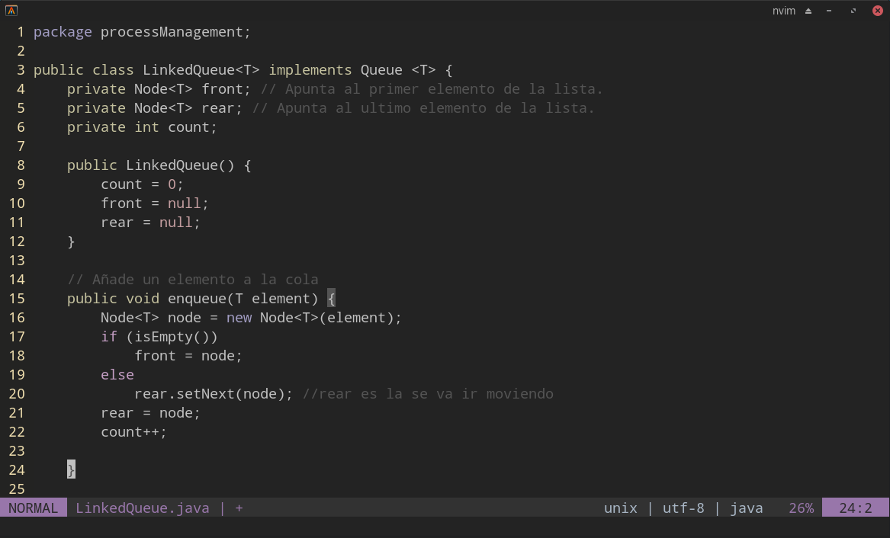

# Configuracion nvim o vim
Nvim es un fork de Vim haciendo mejoras a vim, anteriormente utilizaba vim pero conforme surgian nuevas necesidades 
que yo requeria, como por ejemplo el portapapeles, el poder copiar codigo de vim y utilizarlo en otra aplicaciones,
en la version de vim que tenia no funcionaba, todo era interno en vim con nvim pude resolver eso.

El archivo init de vim, el cual es el que es ejecutado cuando se inicia vim por primera vez, se encuentra en:
~~~
~/.config/nvim/init.vim
~~~

# Guide vim
~~~
q: quit
w : save
qw: save and quit
q!: quit fource brute.
v : visualizasion
C-f : Next page
C-b : Back page
y : copy
d : cut
p : paste
C-u : undo
~~~

### Default font
Cascadia Code Regular

